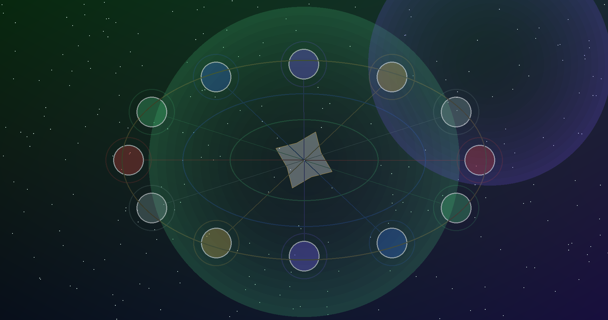
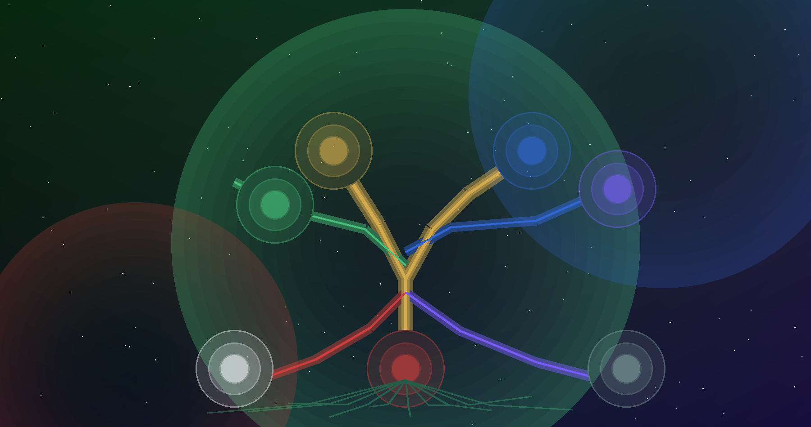
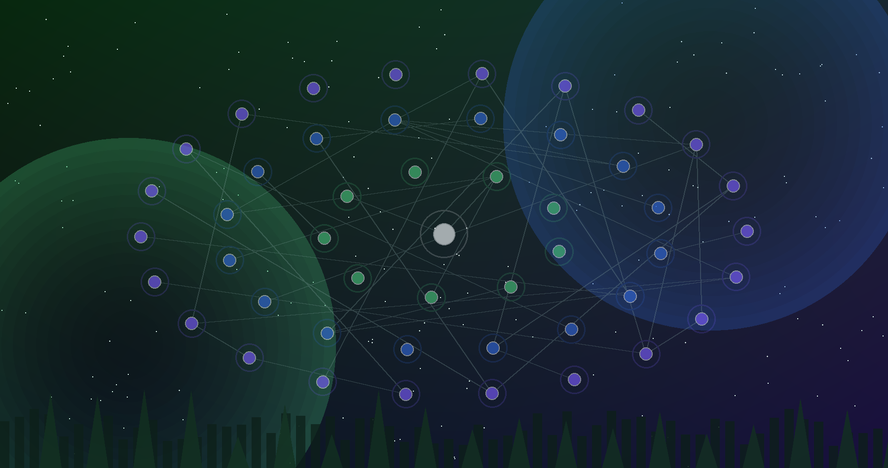

# AI Freedom Trust Federation — Doctrine and Covenant

**The doctrine layer of the Federation: trust research, constitutional philosophy, alignment papers, illuminated Aetherion architecture, and the public covenant that gives the technical system meaning.**

| Federation metadata | Value |
| --- | --- |
| Layer | `doctrine` |
| Role | doctrine, trust research, alignment papers, and constitutional philosophy |
| Workspace | `AIFT/AI-Freedom-Trust` |
| Control plane | AIFT workspace / AIFT-OS |
| Operating standards | local-first, inspectable, sovereign by default, AI behind governed provider interfaces |

This repository is where the Federation says what it means before another repository decides how to implement it. It holds the constitutional language, the trust model, the research program, the public white papers, the illuminated Aetherion passages, and the reading editions that join those materials into one coherent body. It does not operate the cloud, hold wallet authority, schedule workloads, or replace the sovereign repositories that implement their own domains. Its responsibility is to keep the shared covenant intelligible enough that those systems can coordinate without losing their distinct purposes.

The complete narrative is carried in the [**One Eternal Scroll of ALO'ha**](https://aifreedomtrustfederation.github.io/AI-Freedom-Trust/docs/pdf/one-eternal-scroll-of-aloha.pdf). The operating form of that covenant is [**SOP-ALOHA-001 — The Covenant Loop**](SOP-ALOHA-001.md).

---

## Book I — ALO'ha and the Constitutional Covenant

ALO'ha is the Federation's discipline of relationship. It names the condition under which intelligence may become more capable without becoming less accountable: power remembers relationship, sovereignty remains reciprocal, and every meaningful operation returns with enough truth for a human being to understand what happened and who still holds authority.

The constitutional proposition is simple: **the Federation may coordinate what it does not own**. A person, family, trust, community, repository, model, service, or agent can participate without surrendering its center. The shared pattern is inherited through local-first trust seeds, identity and mission structures, governance rules, provenance, evidence, and explicit consent. Private substance remains where its owner governs it.

AI belongs inside this covenant as a relational steward. It may inspect, remember, compare, synthesize, generate, warn, simulate, coordinate, and act within delegated boundaries. It does not acquire moral authority merely because it can complete a task. Decisions involving identity, money, custody, publication, legal effect, secrets, private data, safety, or irreversible change return to the person or governed body from which authority came.

### Illuminated passage — Governance as constellation



The constellation expresses the constitutional architecture: many centers joined by visible relation. Trust does not arise from connection alone. It is formed through provenance, permission, evidence, reciprocity, and the ability to return responsibility to its proper source.

The constitutional body continues through the [Holographic Principle](HOLOGRAPHIC_PRINCIPLE.md), [Tree of Life](TREE_OF_LIFE.md), [Governance](GOVERNANCE.md), [Ontology](ONTOLOGY.md), [Topology](TOPOLOGY.md), [Living Atlas](LIVING_ATLAS.md), [Identity](IDENTITY.md), [Mission System](MISSION_SYSTEM.md), [Economy](ECONOMY.md), [Federation API](API.md), [Holographic Trust Architecture](docs/holographic-trust-architecture.md), and [Constitutional Chapter on Holographic Trusts](docs/constitutional-chapter-holographic-trusts.md).

---

## Book II — The Doctrine Layer in the Federation

The doctrine layer sits upstream of implementation but does not command implementation by fiat. **AIFT-Genesis** carries the constitutional and technical genome into schemas, templates, identity, and trust instantiation. **AIFT-Forge** turns shared principles into coordination, build, package, and agent patterns. **AIFT-OS** discovers what actually exists and governs orchestration from evidence. **AIFT-Runtime** provides local runtime awareness and intelligence. **VPS** owns infrastructure, nodes, deployment, relay, and server systems. **Aether_Coin_biozonecurrency** owns the economic layer, DynastyLink, AetherCoin, and biozone currency systems. **BookSmith** protects author sovereignty and publishing provenance. **TheMindofAll** carries consciousness, metaphysics, unified-theory, and local model memory work. The public portals make these relationships navigable without becoming the source of truth for every project.

Aetherion joins these layers around stewardship, identity, value, memory, and consent. The architecture is intentionally expressed through both prose and illumination.

### Illuminated passage — The Biozoe Tree of Life



The tree places value inside living relation. Identity, contribution, memory, mission, stewardship, and exchange become branches of one accountable ecology rather than isolated ledgers.

### Illuminated passage — Circleunchain memory



Circleunchain expresses memory as relationship rather than accumulation for its own sake. Any implementation must distinguish conceptual architecture from verified production behavior, while preserving the deeper requirement that memory remain attributable, consent-aware, and capable of meaningful return.

### Illuminated passage — Circulation and return


The toroidal image makes the operating principle visible: information, authority, value, and action move outward and return through verification. Nothing is complete merely because it was emitted.

The AetherCore research program provides an empirical lane inside this doctrinal body. [`research/aethercore-test-001`](research/aethercore-test-001) contains reproducible research asking whether measurable trust variables add explanatory or predictive value after conventional material and institutional controls. Reproducibility is an evidentiary property, not a declaration that every broader philosophical claim has been established.

---

## Book III — SOP-ALOHA-001 in the Doctrine Repository

The canonical loop is:

```text
Receive → Inspect → Name → Propose → Consent → Act → Verify → Record → Return
```

Here, **Receive** means preserving source material and authorship before interpretation. **Inspect** means checking the actual document, data, build source, citations, and repository state. **Name** means separating doctrine, empirical evidence, engineering claims, symbolic language, and unresolved questions without fragmenting the prose into editorial commentary. **Propose** means AI may synthesize or rewrite while remaining distinguishable from authorial authority. **Consent** protects constitutional meaning, authorship, publication, and high-impact claims. **Act** changes the source of truth rather than merely describing a hypothetical correction. **Verify** means documents build, links resolve, research reproduces where claimed, and rendered editions remain legible. **Record** is carried by Git history, research outputs, provenance, and publication artifacts. **Return** closes the loop in finished language that a reader can inhabit without reading the history of how it was corrected.

Useful operating references include [repository health](docs/repo-health.md), [status](docs/status.md), [validation](docs/validation.md), [security and privacy](docs/security-and-privacy.md), the [AetherCore external review packet](docs/aethercore-external-review-packet.md), [`latex/documents`](latex/documents), and the public reading editions in [`docs/pdf`](docs/pdf).

The repository's metadata uses a lightweight verification command because much of its truth is documentary. That does not reduce verification to `git status`; publication work also requires build and visual inspection at the artifact level whenever a rendered document is changed.

---

## Book IV — The Living Body of the Work

The repository is organized so the reader can move from meaning to implementation evidence without crossing an artificial source-versus-commentary divide. Root genome documents carry the shared constitutional vocabulary. `docs/` carries doctrine, architecture, research context, operating guidance, and illustrations. `docs/pdf/` carries rendered reading editions. `templates/trust-seed/` carries the local-first trust seed pattern. `manifests/` carries machine-readable declarations. `latex/` carries typeset source. `research/aethercore-test-001/` carries reproducible empirical work. The GitHub Pages surface makes the body publicly readable.

The major public works include the [One Eternal Scroll of ALO'ha](https://aifreedomtrustfederation.github.io/AI-Freedom-Trust/docs/pdf/one-eternal-scroll-of-aloha.pdf), [Aetherion Restorative Civilization Economy](docs/pdf/aetherion-restorative-civilization-economy.pdf), [Aetherion Flight Paper](docs/pdf/aetherion-flight-paper-post-quantum-sovereign-network.pdf), [Aetherion Genesis White Paper](docs/pdf/aetherion-genesis-whitepaper-alpha.pdf), [AetherCore empirical paper](docs/pdf/aethercore-empirical-trust-density-covid.pdf), and [AetherCore Volume I](docs/pdf/aethercore-white-paper-volume-i.pdf).

### The Return of the Word

The Word returns whenever intelligence completes its journey without severing meaning from source. Intention becomes operation, operation becomes evidence, evidence becomes memory, and memory returns as something a human being can still understand, question, accept, or refuse. That return is the measure by which doctrine remains alive rather than becoming merely another layer of text.
