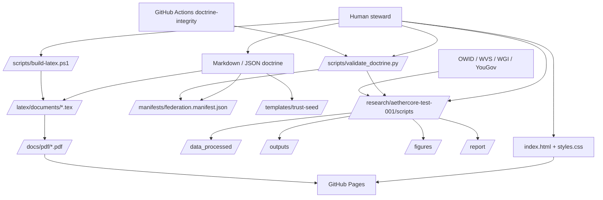
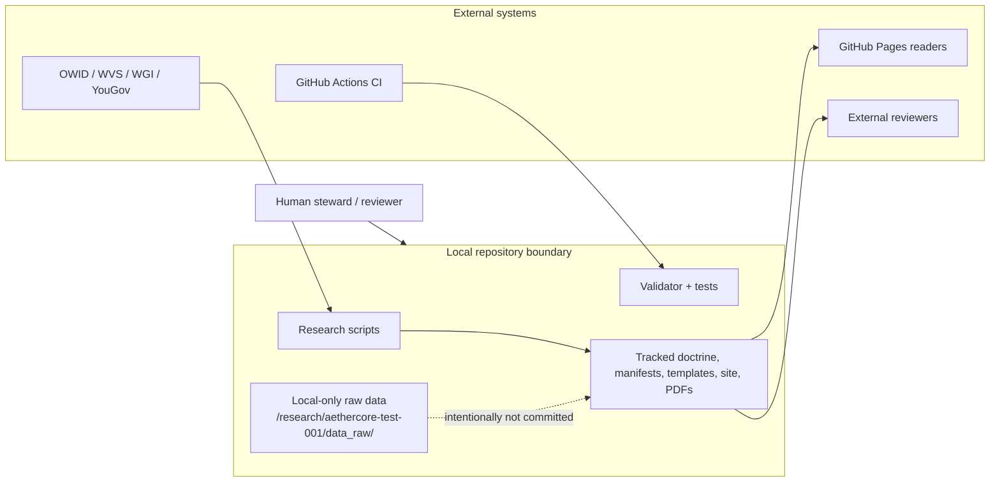

# AI Freedom Trust Architecture Map

Status: discovery snapshot derived from the repository as checked out on 2026-09-23  
Scope: actual repository contents first; intended federation architecture second  
Non-goal: this document does **not** redesign the system

## System overview

### What this repository currently **is** in executable terms

This repository is currently a **documentation-first doctrine and research repository** with five executable surfaces:

1. a static GitHub Pages site rooted at `/index.html` and `/styles.css`;
2. a Python doctrine validator at `/scripts/validate_doctrine.py` with unit tests in `/tests/test_validate_doctrine.py`;
3. an empirical Python research package under `/research/aethercore-test-001/scripts` that generates tracked processed datasets, reports, tables, and figures;
4. a PowerShell LaTeX build script at `/scripts/build-latex.ps1` that compiles `/latex/documents/*.tex` into `/docs/pdf/*.pdf`;
5. repository contract metadata under `/.aift/`, `/aift.repo.json`, and `/manifests/federation.manifest.json`.

Evidence: `/README.md`, `/index.html`, `/.github/workflows/doctrine-integrity.yml`, `/scripts/validate_doctrine.py`, `/research/aethercore-test-001/README.md`, `/scripts/build-latex.ps1`, `/.aift/repo.json`, `/manifests/federation.manifest.json`.

### What the documentation says it intends to become

The documentation describes a **local-first voluntary federation** of trust seeds, identity layers, AI stewards, repository nodes, Living Atlas maps, governance flows, economic records, and optional federation links. In this repository, most of that future system exists as doctrine, templates, manifests, and interface language rather than runnable software.

Evidence: `/README.md`, `/API.md`, `/IDENTITY.md`, `/LIVING_ATLAS.md`, `/TOPOLOGY.md`, `/docs/holographic-trust-architecture.md`, `/templates/trust-seed/README.md`.

### High-level classification

| Area | Reality in this repo |
| --- | --- |
| Static publication | **IMPLEMENTED** |
| Doctrine validation | **IMPLEMENTED** |
| Empirical research package | **PARTIALLY IMPLEMENTED** |
| LaTeX-to-PDF publication | **PARTIALLY IMPLEMENTED** |
| Federation manifest validation | **PARTIALLY IMPLEMENTED** |
| Trust-seed runtime | **SPECIFIED** |
| Identity infrastructure | **SPECIFIED** |
| AI steward runtime | **PARTIALLY IMPLEMENTED** as repo contracts/policies, not as an in-repo agent service |
| Federation API / sync protocol | **SPECIFIED** |
| Cryptographic trust network | **CONCEPTUAL** |

## Dependency map

## Trust-boundary map

## Component inventory

### 1. Static publication surface

- **Status:** IMPLEMENTED
- **Purpose:** Publish a public umbrella page and link readers to doctrine, PDFs, research, and sibling repositories.
- **Entrypoints:** `/index.html`
- **Important files:** `/index.html`, `/styles.css`, `/assets/aift-federation-hero.png`, `/.nojekyll`, `/docs/github-pages.md`
- **Dependencies:** GitHub Pages hosting; browser runtime; linked PDFs and docs
- **Inputs:** tracked HTML, CSS, assets, links to docs/PDFs
- **Outputs:** static public pages
- **Trust boundaries:** public web boundary begins at GitHub Pages publication; all page content is world-readable
- **Security assumptions:** no server-side secrets; publication safety depends on not linking or embedding private data
- **Tests:** none for HTML/CSS/link integrity in this repo
- **Documentation:** `/README.md`, `/docs/github-pages.md`, `/docs/status.md`
- **Known gaps:** no automated site validation; Pages deployment is described through repository settings rather than codified workflow; public-site ownership is split between this repo and `/docs/organization-map.md`, which says `/www.aifreedomtrust.com` should be canonical

### 2. Governance and doctrine corpus

- **Status:** IMPLEMENTED as documentation, not executable enforcement
- **Purpose:** Define constitutional language, governance, ontology, topology, identity, mission, economy, and covenant rules
- **Entrypoints:** `/README.md`, `/SOP-ALOHA-001.md`, root doctrine files, `/docs/*.md`
- **Important files:** `/README.md`, `/GOVERNANCE.md`, `/ONTOLOGY.md`, `/TOPOLOGY.md`, `/IDENTITY.md`, `/MISSION_SYSTEM.md`, `/ECONOMY.md`, `/LIVING_ATLAS.md`, `/docs/holographic-trust-architecture.md`, `/docs/constitutional-chapter-holographic-trusts.md`
- **Dependencies:** Markdown readers, Git history, human interpretation
- **Inputs:** author and steward edits
- **Outputs:** normative architecture, governance rules, public doctrine
- **Trust boundaries:** human review boundary; public-claim boundary; doctrinal text must not be mistaken for deployed capability
- **Security assumptions:** human stewards keep conceptual, empirical, legal, and production claims separated
- **Tests:** no direct tests of doctrine semantics; only path/syntax validation around referenced files
- **Documentation:** the subsystem is itself documentation
- **Known gaps:** doctrine is broad, but enforcement is mostly social rather than machine-enforced; several documents describe future systems without executable counterparts

### 3. Federation manifests and repository contracts

- **Status:** PARTIALLY IMPLEMENTED
- **Purpose:** Declare repository role, standards, federation principles, manual contracts, capabilities, events, and trust-seed defaults in machine-readable form
- **Entrypoints:** `/manifests/federation.manifest.json`, `/aift.repo.json`, `/.aift/repo.json`, `/.aift/capabilities.json`, `/.aift/events.json`, `/.aift/services.json`, `/.aift/manual.json`, `/templates/trust-seed/LOCAL_MANIFEST.json`
- **Important files:** same as entrypoints plus `/scripts/validate_doctrine.py`
- **Dependencies:** JSON readers, validator script, external AIFT-OS / BookSmith ecosystem mentioned in contracts
- **Inputs:** hand-maintained JSON manifests and generated capability metadata
- **Outputs:** declarative repo metadata and trust-seed metadata
- **Trust boundaries:** contract metadata is public and inspectable; external control-plane paths in `/aift.repo.json` point outside this repo
- **Security assumptions:** manifest paths stay repository-relative and non-symlinked; trust seed defaults preserve `local-private` state
- **Tests:** `/tests/test_validate_doctrine.py` covers manifest-path and invariant validation for `/scripts/validate_doctrine.py`
- **Documentation:** `/FEDERATION.md`, `/API.md`, `/docs/manual/source/man7/modularity.md`, `/docs/manual/source/man7/truthfulness.md`
- **Known gaps:** only a small subset of promised manifests exists; `/API.md` names future manifest types such as `trust.manifest.json`, `tree.manifest.json`, `agent.policy.json`, `mission.manifest.json`, `atlas.node.json`, and `economy.record.json`, but this repo currently ships only `/manifests/federation.manifest.json` plus `/templates/trust-seed/LOCAL_MANIFEST.json`; `/.aift/capabilities.json` still marks `verify`, `test`, `build`, `start`, `stop`, `health`, and `deploy` as planned

### 4. Trust-seed architecture

- **Status:** PARTIALLY IMPLEMENTED as templates and a manifest, not as an instantiation tool or runtime
- **Purpose:** Provide the minimum local-first trust pattern for a person, family, business, project, or repository
- **Entrypoints:** `/templates/trust-seed/README.md`, `/templates/trust-seed/LOCAL_MANIFEST.json`
- **Important files:** `/templates/trust-seed/TRUST.md`, `/templates/trust-seed/TREE_OF_LIFE.md`, `/templates/trust-seed/GOVERNANCE.md`, `/templates/trust-seed/ECONOMY.md`, `/templates/trust-seed/AI_STEWARD.md`, `/templates/trust-seed/MAP.md`, `/templates/trust-seed/LOCAL_MANIFEST.json`
- **Dependencies:** Markdown and JSON only
- **Inputs:** future trust-specific values replacing `TODO` placeholders
- **Outputs:** a local trust-seed folder structure and manifest
- **Trust boundaries:** privacy/publication boundaries are declared but not enforced by code in this repo
- **Security assumptions:** trust stewards will fill in disclosure, approval, and AI permission rules honestly
- **Tests:** none
- **Documentation:** `/templates/trust-seed/README.md`, `/HOLOGRAPHIC_PRINCIPLE.md`, `/docs/holographic-trust-architecture.md`
- **Known gaps:** no generator, schema validator, sync engine, encryption layer, or local application runtime; the trust seed is a static template today

### 5. Identity and trust mechanisms

- **Status:** SPECIFIED
- **Purpose:** Define local identity, trust identity, public federation identity, agent identity, and permission boundaries
- **Entrypoints:** `/IDENTITY.md`, `/templates/trust-seed/TRUST.md`, `/templates/trust-seed/AI_STEWARD.md`, `/templates/trust-seed/LOCAL_MANIFEST.json`
- **Important files:** `/IDENTITY.md`, `/docs/constitutional-chapter-holographic-trusts.md`, `/docs/holographic-trust-architecture.md`
- **Dependencies:** none in code; future dependencies are documented conceptually
- **Inputs:** local records, permissions, future keys/credentials/attestations
- **Outputs:** identity rules and template placeholders
- **Trust boundaries:** private, shared, public, AI-readable, AI-writable, and publishable zones are specified in prose
- **Security assumptions:** a trust can exist locally before public disclosure; sensitive identity data remains local
- **Tests:** none
- **Documentation:** `/IDENTITY.md`, `/templates/trust-seed/TRUST.md`, `/templates/trust-seed/AI_STEWARD.md`
- **Known gaps:** `/IDENTITY.md` explicitly says user-controlled keys, credentials, attestations, and recovery paths are future work; there is no key management, attestation, identity proof, or revocation code in this repo

### 6. AI and agent components

- **Status:** PARTIALLY IMPLEMENTED as policy and repo contracts
- **Purpose:** Describe how AI stewards should behave and how repository capabilities/events are exposed to a larger AIFT toolchain
- **Entrypoints:** `/AGENTS.md`, `/templates/trust-seed/AI_STEWARD.md`, `/.aift/repo.json`, `/.aift/capabilities.json`, `/.aift/events.json`, `/.aift/services.json`, `/.aift/commands/status.sh`
- **Important files:** same as entrypoints plus `/docs/manual/source/man7/truthfulness.md`
- **Dependencies:** shell, Git, external AIFT-OS and BookSmith assumptions
- **Inputs:** repository state, approved files, future capability commands
- **Outputs:** policy, capability declarations, one working status command
- **Trust boundaries:** explicit human approval for publication, secrets, identity-sensitive changes, permission changes, and high-impact actions
- **Security assumptions:** AI remains bounded by human approval and should not overstate claims or leak private data
- **Tests:** none for `/.aift/commands/status.sh`; indirect policy coverage only through human review
- **Documentation:** `/AGENTS.md`, `/templates/trust-seed/AI_STEWARD.md`, `/SOP-ALOHA-001.md`
- **Known gaps:** only `status` is concretely implemented in `/.aift/commands/status.sh`; the rest of the capability surface is still planned; there is no in-repo long-running agent, sandbox manager, memory store, or provider interface implementation

### 7. Research package: AetherCore empirical lane

- **Status:** PARTIALLY IMPLEMENTED
- **Purpose:** Run exploratory, reproducible country-level trust analyses and publish the resulting evidence packet
- **Entrypoints:** `/research/aethercore-test-001/scripts/run_analysis.py` and `/research/aethercore-test-001/scripts/run_*`
- **Important files:** `/research/aethercore-test-001/README.md`, `/research/aethercore-test-001/requirements.txt`, `/research/aethercore-test-001/ARTIFACT_POLICY.md`, all eight scripts under `/research/aethercore-test-001/scripts/`, tracked outputs under `/research/aethercore-test-001/data_processed/`, `/outputs/`, `/figures/`, and `/report/`
- **Dependencies:** Python 3.13.x baseline, `pandas`, `numpy`, `statsmodels`, `matplotlib`, `seaborn`, `scipy`, `openpyxl`, `pyreadstat`, `requests`; remote data sources OWID, WVS/OSF, WGI, YouGov
- **Inputs:** local-only raw datasets under `/research/aethercore-test-001/data_raw/` plus fetched public datasets; tracked processed derivatives from prior runs
- **Outputs:** processed CSVs, regression outputs, JSON summaries, figures, and markdown reports
- **Trust boundaries:** raw data is intentionally local-only; processed data and generated outputs are public/tracked; external data sources are outside repo control
- **Security assumptions:** raw licensed files are not committed; upstream remote downloads are trustworthy enough for exploratory research; outputs remain labeled correlational and exploratory
- **Tests:** no dedicated script-level test suite; `/scripts/validate_doctrine.py` only compiles research scripts for syntax
- **Documentation:** `/research/aethercore-test-001/README.md`, `/research/aethercore-test-001/ARTIFACT_POLICY.md`, `/docs/aethercore-external-review-packet.md`, `/docs/status.md`
- **Known gaps:** full rerun depends on unavailable local raw data and changing upstream sources; no automated regression tests for analysis correctness; some tracked outputs embed operator-local absolute filesystem paths, e.g. `/research/aethercore-test-001/outputs/test003_trust_taxonomy_audit.json` and `/research/aethercore-test-001/report/aethercore_test_003_trust_taxonomy.md`

### 8. LaTeX and PDF publication pipeline

- **Status:** PARTIALLY IMPLEMENTED
- **Purpose:** Build polished PDF editions from tracked LaTeX sources
- **Entrypoints:** `/scripts/build-latex.ps1`
- **Important files:** `/scripts/build-latex.ps1`, `/latex/README.md`, `/latex/documents/*.tex`, `/latex/styles/aftdoctrine.sty`, `/docs/pdf/*.pdf`
- **Dependencies:** `xelatex`; PowerShell; local LaTeX environment
- **Inputs:** `.tex` source documents and shared style file
- **Outputs:** PDFs copied into `/docs/pdf/`
- **Trust boundaries:** generated PDFs are public artifacts; local build toolchain is outside repo control
- **Security assumptions:** PDFs accurately represent source; builders inspect output before publication
- **Tests:** no automated PDF build in CI for this repo
- **Documentation:** `/latex/README.md`, `/docs/validation.md`, `/docs/status.md`
- **Known gaps:** PDF build is manual and environment-dependent; CI does not verify that tracked PDFs match current LaTeX sources; build cannot run without `xelatex`

### 9. CI/CD and validation infrastructure

- **Status:** IMPLEMENTED for lightweight doctrine validation; PARTIALLY IMPLEMENTED for publication assurance
- **Purpose:** prevent doctrine-manifest path drift and Python syntax regressions, and provide a minimal PR/push gate
- **Entrypoints:** `/.github/workflows/doctrine-integrity.yml`, `/scripts/validate_doctrine.py`, `/tests/test_validate_doctrine.py`
- **Important files:** same as entrypoints plus `/docs/validation.md`
- **Dependencies:** GitHub Actions, Python 3.13
- **Inputs:** repository checkout
- **Outputs:** CI pass/fail signal; validator stdout; unit-testable validation behavior
- **Trust boundaries:** GitHub-hosted CI environment; read-only contents permission in workflow
- **Security assumptions:** workflow uses `contents: read` and `persist-credentials: false`; validator must not modify checkout
- **Tests:** `/tests/test_validate_doctrine.py`
- **Documentation:** `/docs/validation.md`, `/AGENTS.md`, `/docs/repo-health.md`
- **Known gaps:** CI does not run unit tests, HTML checks, link checks, PDF checks, or full empirical reruns; `verify` capability metadata does not expose the documented validation gate as a repo command

### 10. APIs and protocols

- **Status:** SPECIFIED
- **Purpose:** define how trusts, missions, repositories, atlas nodes, governance proposals, economy records, and AI steward contexts should interoperate
- **Entrypoints:** `/API.md`, `/SOP-ALOHA-001.md`
- **Important files:** `/API.md`, `/ONTOLOGY.md`, `/TOPOLOGY.md`, `/LIVING_ATLAS.md`, `/MISSION_SYSTEM.md`
- **Dependencies:** none implemented here
- **Inputs:** future manifests and provider interfaces
- **Outputs:** protocol vocabulary and design rules
- **Trust boundaries:** the API doctrine repeatedly states that federation must remain opt-in and private data must not be centralized by default
- **Security assumptions:** manifest-first design plus explicit consent will be implemented later
- **Tests:** none
- **Documentation:** subsystem is entirely documentation
- **Known gaps:** no schemas for the listed resource types, no HTTP/local API, no sync protocol, no serialization contracts beyond a few JSON manifests, and no compatibility tests

### 11. Persistence and storage model

- **Status:** PARTIALLY IMPLEMENTED
- **Purpose:** store doctrine, manifests, trust templates, research artifacts, and public PDFs in inspectable file-based form
- **Entrypoints:** Git-tracked filesystem layout
- **Important files/directories:** `/docs/`, `/templates/trust-seed/`, `/manifests/`, `/research/aethercore-test-001/data_processed/`, `/research/aethercore-test-001/outputs/`, `/research/aethercore-test-001/figures/`, `/research/aethercore-test-001/report/`, `/docs/pdf/`
- **Dependencies:** Git; local filesystem
- **Inputs:** human-authored text, generated research outputs, generated PDFs
- **Outputs:** versioned repository state and public artifacts
- **Trust boundaries:** raw research inputs are intentionally excluded in `/research/aethercore-test-001/data_raw/`; public outputs are tracked
- **Security assumptions:** file-based storage is sufficient for current doctrine/research role; no hidden server database is needed in this repo
- **Tests:** none beyond validator path checks
- **Documentation:** `/docs/security-and-privacy.md`, `/research/aethercore-test-001/ARTIFACT_POLICY.md`, `/docs/validation.md`
- **Known gaps:** no database, no encrypted local vault, no per-file access control, and no provenance sanitizer for generated outputs that can capture host-specific paths

### 12. Cryptographic components

- **Status:** CONCEPTUAL
- **Purpose:** describe future post-quantum, crypto-agile, signature, custody, and proof systems for Aetherion and related value/identity layers
- **Entrypoints:** `/docs/aetherion-flight-paper-post-quantum-sovereign-network.md`, `/docs/aetherion-genesis-whitepaper-alpha.md`, `/IDENTITY.md`
- **Important files:** `/docs/aetherion-flight-paper-post-quantum-sovereign-network.md`, `/docs/aetherion-restorative-civilization-economy.md`, `/IDENTITY.md`
- **Dependencies:** future external cryptographic implementations; none in current code
- **Inputs:** conceptual design choices and future standards such as ML-KEM / ML-DSA / SLH-DSA discussed in docs
- **Outputs:** design doctrine only
- **Trust boundaries:** cryptographic claims remain documentation-only in this repo and must not be mistaken for audited implementation
- **Security assumptions:** future systems can achieve crypto-agility and post-quantum readiness, but this repository currently provides no executable cryptographic verification
- **Tests:** none
- **Documentation:** Aetherion papers and identity doctrine
- **Known gaps:** no key generation, signing, verification, attestations, proofs, or wallet/runtime code exists here

## Implementation-status matrix

| Subsystem | Status | Why |
| --- | --- | --- |
| Static site | IMPLEMENTED | `/index.html` + `/styles.css` are runnable static assets and `/docs/github-pages.md` documents publication |
| Doctrine validator | IMPLEMENTED | `/scripts/validate_doctrine.py` runs in CI and has unit coverage in `/tests/test_validate_doctrine.py` |
| Federation manifest layer | PARTIALLY IMPLEMENTED | core manifest exists and is validated, but broader manifest family is still absent |
| Trust-seed architecture | PARTIALLY IMPLEMENTED | template files and `LOCAL_MANIFEST.json` exist, but no instantiation/runtime path exists |
| Identity system | SPECIFIED | doctrine exists; executable identity infrastructure does not |
| AI steward repo contract | PARTIALLY IMPLEMENTED | policy files and one status command exist; no agent runtime or full capability set |
| AetherCore research suite | PARTIALLY IMPLEMENTED | substantial code and outputs exist, but reruns depend on raw/local/remote data and lack correctness tests |
| LaTeX publication pipeline | PARTIALLY IMPLEMENTED | build script and sources exist; build is manual and not CI-enforced |
| Governance / doctrine | IMPLEMENTED as docs | the documentation corpus exists and is authoritative, but it is not executable control logic |
| Deployment infrastructure | PARTIALLY IMPLEMENTED | static Pages publication exists; no full deployment automation or infra-as-code in this repo |
| APIs / protocols | SPECIFIED | `/API.md` defines resource concepts only |
| Persistence / storage | PARTIALLY IMPLEMENTED | file-based storage exists; no runtime data layer or private vault |
| Cryptographic layer | CONCEPTUAL | papers discuss designs; no crypto code exists |
| CI/CD | IMPLEMENTED for lightweight validation | one GitHub Actions gate exists, but broader verification is missing |

## Actual trust and data flow

### Doctrine/publication flow that exists today

1. A human steward edits Markdown, JSON, HTML, CSS, LaTeX, or research code locally.  
2. `/scripts/validate_doctrine.py` verifies declared doctrine paths and compiles research scripts for syntax.  
3. Optional local publication work runs via `/scripts/build-latex.ps1` and the research scripts under `/research/aethercore-test-001/scripts`.  
4. Generated PDFs go to `/docs/pdf/`; generated research artifacts go to `/research/aethercore-test-001/data_processed/`, `/outputs/`, `/figures/`, and `/report/`.  
5. GitHub Actions reruns the lightweight doctrine validator on push/PR via `/.github/workflows/doctrine-integrity.yml`.  
6. GitHub Pages serves `/index.html` plus linked docs/PDFs to public readers.

### Research data flow that exists today

1. Raw WVS/YouGov/WGI/OWID inputs are placed in or downloaded into `/research/aethercore-test-001/data_raw/` by the local operator or the scripts.  
2. Python scripts transform those inputs into country-level processed CSVs in `/research/aethercore-test-001/data_processed/`.  
3. Analysis scripts generate summary CSV/JSON outputs, PNG figures, and Markdown reports.  
4. The public evidence packet links those outputs through `/research/aethercore-test-001/README.md`, `/docs/aethercore-external-review-packet.md`, and `/docs/pdf/aethercore-empirical-trust-density-covid.pdf`.

### Requested flow: `User → local node → trust seed → identity → AI/agent → federation → external node`

| Stage | What actually exists here |
| --- | --- |
| User | **Exists indirectly.** Human stewards/reviewers are assumed throughout `/AGENTS.md` and `/SOP-ALOHA-001.md`, but there is no user account system in this repo. |
| Local node | **PARTIALLY IMPLEMENTED.** The closest real local node is the local Git repository plus `/.aift/` metadata, file-based doctrine, scripts, and templates. There is no local app shell or daemon. |
| Trust seed | **PARTIALLY IMPLEMENTED.** `/templates/trust-seed/` provides the structure, but only as templates. |
| Identity | **SPECIFIED.** `/IDENTITY.md` and trust-seed docs define layers and permissions, but there is no identity runtime. |
| AI/agent | **PARTIALLY IMPLEMENTED.** Policy and capability metadata exist, plus `/.aift/commands/status.sh`; no in-repo steward service exists. |
| Federation | **SPECIFIED.** `/API.md`, `/FEDERATION.md`, `/TOPOLOGY.md`, and `/manifests/federation.manifest.json` define the idea, but there is no federation sync/network implementation here. |
| External node | **PARTIALLY IMPLEMENTED only as publication endpoints.** GitHub Pages, GitHub Actions, remote data sources, and external reviewers exist; no federated peer-node protocol exists in this repo. |

**Conclusion:** the full trust-and-federation chain is not executable end to end in this repository. The repository currently supports **documentation, publication, validation, and research generation**, while most trust-seed, identity, agent, and federation runtime behavior remains template/specification work.

## Principles assessment

| Principle | Conclusion | Evidence |
| --- | --- | --- |
| Sovereign user control | **Partially satisfied** | strong doctrinal protection exists in `/SOP-ALOHA-001.md`, `/GOVERNANCE.md`, `/IDENTITY.md`, and `/templates/trust-seed/AI_STEWARD.md`; no executable user-control runtime exists here |
| Local-first operation | **Partially satisfied** | doctrine and trust-seed docs emphasize local-first; the repo is file-based and usable locally; research and LaTeX scripts run locally; federation runtime is not implemented (`/README.md`, `/docs/holographic-trust-architecture.md`, `/templates/trust-seed/README.md`) |
| Federation optionality | **Specified and partially encoded** | `/manifests/federation.manifest.json` sets `federationOptional: true`; `/templates/trust-seed/LOCAL_MANIFEST.json` defaults `federationLink.enabled` to `false`; no sync engine exists |
| Privacy by default | **Partially satisfied** | manifests default to `local-private`; `/docs/security-and-privacy.md` and `.gitignore` keep raw data local-only; however some tracked generated artifacts leak operator-local absolute paths |
| Inspectability | **Strongly satisfied** | doctrine, templates, scripts, CI, reports, LaTeX sources, and generated PDFs are tracked in plain files |
| Reproducibility | **Partially satisfied** | research package has pinned dependencies and tracked outputs, but full rerun depends on missing local raw data and mutable external data sources (`/research/aethercore-test-001/README.md`, `/docs/validation.md`) |
| Least privilege | **Partially satisfied** | CI uses `contents: read` and disables credential persistence; there are no privileged app services here; research scripts still require outbound network access for some fetches |
| Explicit trust boundaries | **Partially satisfied** | boundaries are clearly documented in `/AGENTS.md`, `/docs/security-and-privacy.md`, `/IDENTITY.md`, `/templates/trust-seed/*.md`, but only lightly enforced in code |
| Cryptographic verification where appropriate | **Not currently satisfied in code** | cryptographic trust is discussed in Aetherion papers and identity doctrine, but no executable cryptographic verification exists in this repository |

## Implemented-vs-conceptual analysis

### Implemented

- Static GitHub Pages assets: `/index.html`, `/styles.css`, `/assets/*`
- Doctrine validation: `/scripts/validate_doctrine.py`
- Validator unit tests: `/tests/test_validate_doctrine.py`
- Research scripts and tracked outputs: `/research/aethercore-test-001/`
- LaTeX build script and public PDFs: `/scripts/build-latex.ps1`, `/latex/`, `/docs/pdf/`
- Minimal agent-capability command: `/.aift/commands/status.sh`

### Partially implemented

- Federation manifest layer
- Trust-seed template layer
- AI/repository capability contracts
- AetherCore reproducibility lane
- Pages/publication/deployment infrastructure
- File-based persistence model

### Specified

- Federation API resources and interoperability model
- Identity layers, permissions, and credential model
- Living Atlas repository node model
- Mission system and economy records
- Federation-wide sync/publish/verify behavior

### Conceptual

- Aetherion post-quantum cryptographic network
- Wallet / custody / proof / staking-like validation systems
- Full sovereign local app/node experience beyond templates and docs

## Architectural contradictions, duplicate concepts, stale documents, and orphaned pieces

1. **Public-site ownership is inconsistent.**  
   `/docs/github-pages.md` says this repo already publishes the public site, while `/docs/organization-map.md` says `/www.aifreedomtrust.com` should become the canonical website repository, and `/PROJECT-MONITOR.md` still describes this repo itself as a static GitHub Pages website and command center.

2. **Validation doctrine and repo contract are out of sync.**  
   `/docs/validation.md` says repository validation is `git diff --check` plus `python scripts/validate_doctrine.py`, but `/aift.repo.json` defines `verify` only as `git status --short`, and `/.aift/capabilities.json` still marks `verify` as planned.

3. **API doctrine promises more manifest types than exist.**  
   `/API.md` lists multiple manifest-first resources, but this repo currently validates only `/manifests/federation.manifest.json` and ships one trust-seed manifest template.

4. **The manual pipeline contract is incomplete.**  
   `/.aift/manual.json` declares `docs/manual/assets` and a BookSmith build capability, but `/docs/manual/assets` is absent and the manual tree contains only a minimal skeleton (`/docs/manual/source/index.md`, `/docs/manual/source/man0/00-introduction.md`, selected `man7` pages).

5. **Research privacy posture and tracked artifacts conflict at least once.**  
   `/docs/security-and-privacy.md` and trust doctrine emphasize privacy/local-first handling, but `/research/aethercore-test-001/outputs/test003_trust_taxonomy_audit.json` and `/research/aethercore-test-001/report/aethercore_test_003_trust_taxonomy.md` embed a host-local Windows raw-data path.

6. **AI/agent language is richer than the implementation.**  
   `/AGENTS.md`, `/SOP-ALOHA-001.md`, and `/templates/trust-seed/AI_STEWARD.md` describe bounded AI stewardship, but the only concrete in-repo agent execution surface is a one-line status shell command.

7. **Repository-external architecture is referenced as if nearby, not present.**  
   `/README.md`, `/docs/repo-health.md`, `/docs/organization-map.md`, and `/PROJECT-MONITOR.md` describe sibling repositories and roles, but those implementations are outside this repository and should not be confused with code present here.

## Missing interfaces

1. A callable repository `verify` command that matches the documented validation gate
2. A trust-seed instantiation/generation interface
3. Schema validation for the broader manifest family described in `/API.md`
4. An identity credential / key / attestation interface
5. A federation sync/publish protocol
6. A repo-local AI steward runtime or provider contract beyond `status`
7. A reproducibility harness for research reruns and diff review
8. A PDF/source equivalence check
9. A sanitizer/provenance policy preventing local filesystem path leakage in public artifacts
10. A concrete BookSmith manual build interface usable from this repo

## Security assumptions

- Public source contains no required secrets and should not contain raw licensed datasets (`/docs/security-and-privacy.md`, `.gitignore`).
- Sensitive actions require explicit human approval by doctrine, not by code enforcement alone (`/AGENTS.md`, `/SOP-ALOHA-001.md`, `/templates/trust-seed/AI_STEWARD.md`).
- GitHub Actions is expected to remain read-only for this repo’s current validation workflow (`/.github/workflows/doctrine-integrity.yml`).
- Research scripts trust upstream data availability and integrity enough for exploratory analysis, but they do not pin remote snapshots or verify signatures.
- PDF publication assumes local builders visually inspect outputs because CI does not rebuild or compare them.
- Most federation, identity, and cryptographic safety properties are **promised by documentation**, not guaranteed by executable controls in this repo.

## Prioritized architectural gaps

1. **Missing executable verification interface for the repository contract**  
   High leverage because the repo already has working validation logic but does not expose it as a first-class capability.

2. **Trust seed is template-only**  
   Important because the local-first trust model is central to the doctrine but not yet instantiable.

3. **Identity and credential layer remains prose-only**  
   Important because many other systems depend on identity and permission boundaries.

4. **Federation API/protocol remains prose-only**  
   Important because manifests, atlas nodes, mission records, and optional federation links lack interoperable machine contracts.

5. **Publication assurance is incomplete**  
   Important because PDFs, site content, and research outputs can drift from sources without automated detection.

6. **Research reproducibility is real but fragile**  
   Important because raw data is local-only, remote sources can drift, and generated artifacts can capture local machine details.

## One smallest high-impact engineering step (proposal only; do not implement yet)

### Step

Implement a **repository `verify` capability** that runs the already-documented local validation gate and declare it in the repo contracts.

### Why this is needed

- `/docs/validation.md` and `/AGENTS.md` already define the practical validation gate: `git diff --check` plus `python scripts/validate_doctrine.py`.
- `/.github/workflows/doctrine-integrity.yml` already runs part of that gate in CI.
- `/aift.repo.json` still claims `verify` is just `git status --short`, and `/.aift/capabilities.json` still marks `verify` as `planned`.
- This is the smallest step that converts an important architectural promise from **SPECIFIED/PARTIALLY IMPLEMENTED** into a real, callable repository interface without inventing new architecture.

### Exact scope

- Add one executable command script for `verify` under `/.aift/commands/`.
- Update `/.aift/capabilities.json` so `verify` points to the command and is no longer merely planned once evidence is confirmed.
- Update `/aift.repo.json` so the repo-level `verify` command reflects the actual validation gate.
- Update any closely related manual/contract documentation only if needed to keep the contract accurate.

### Affected files

- `/.aift/commands/verify.sh` (new)
- `/.aift/capabilities.json`
- `/aift.repo.json`
- possibly `/docs/manual/source/man0/00-introduction.md` or `/docs/manual/source/man7/truthfulness.md` if the contract text must be synchronized

### Dependencies

- existing `/scripts/validate_doctrine.py`
- Git availability for `git diff --check`
- Python runtime already assumed by CI and validation docs

### Security implications

- Positive: reduces ambiguity about what “verify” means and helps align human/AI/tooling behavior with the documented narrow validation path.
- Positive: keeps validation local and inspectable.
- Low risk: no new network access or secret handling is required.
- Caution: the command should fail loudly and remain read-only.

### Tests required

- Execute the new `verify` command in a clean checkout.
- Confirm it fails on a deliberate whitespace error caught by `git diff --check`.
- Confirm it fails if `/scripts/validate_doctrine.py` fails.
- Keep `/tests/test_validate_doctrine.py` passing.

### Definition of done

Done means:

1. `/.aift/commands/verify.sh` exists and is executable.
2. Running the command performs `git diff --check` and `python scripts/validate_doctrine.py` from the repository root.
3. `/.aift/capabilities.json` marks `verify` with a real command and evidence consistent with the repository state.
4. `/aift.repo.json` no longer describes `verify` as `git status --short`.
5. The repository documentation and capability metadata no longer contradict each other on what verification means.

## Evidence index

- Repository role and scope: `/README.md`, `/FEDERATION.md`, `/docs/status.md`
- Trust-seed architecture: `/templates/trust-seed/*`, `/docs/holographic-trust-architecture.md`, `/HOLOGRAPHIC_PRINCIPLE.md`
- Identity and governance: `/IDENTITY.md`, `/GOVERNANCE.md`, `/SOP-ALOHA-001.md`
- API/protocol doctrine: `/API.md`, `/TOPOLOGY.md`, `/LIVING_ATLAS.md`, `/MISSION_SYSTEM.md`
- Research implementation: `/research/aethercore-test-001/README.md`, `/research/aethercore-test-001/scripts/*.py`, `/research/aethercore-test-001/ARTIFACT_POLICY.md`
- Publication pipeline: `/latex/README.md`, `/scripts/build-latex.ps1`, `/docs/pdf/*`
- Validation/CI: `/docs/validation.md`, `/scripts/validate_doctrine.py`, `/tests/test_validate_doctrine.py`, `/.github/workflows/doctrine-integrity.yml`
- Security/privacy boundaries: `/docs/security-and-privacy.md`, `.gitignore`
